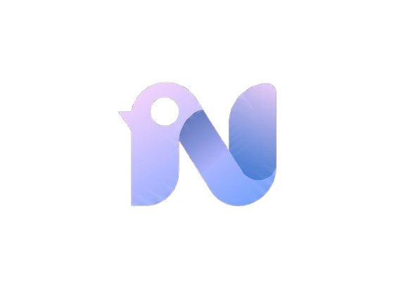

<p align="center">
 
</p>

<h1 align="center">Novex</h1>

<p align="center">
  La plateforme où les idées étudiantes deviennent des projets réels.
</p>

<p align="center">
  
  
  
  
  
  
</p>

---

## C'est quoi Novex ?

Novex est une plateforme communautaire inspirée de ProductHunt, conçue spécifiquement pour les étudiants.

Tu as un projet ? Publie-le. La communauté vote, commente, et les meilleurs profils demandent à rejoindre ton équipe. C'est aussi simple que ça.

---

## Ce que tu peux faire sur Novex

**Publier ton projet**
Ajoute un titre, une description, des images, des liens vers ton GitHub ou ta démo, des tags, et indique si tu cherches des coéquipiers.

**Voter et découvrir**
Explore le feed, filtre par catégorie ou statut, recherche par mots-clés. Upvote les projets qui t'impressionnent.

**Commenter et donner du feedback**
Laisse des commentaires sur n'importe quel projet. Réponds aux commentaires existants. Le feedback constructif fait avancer les projets.

**Rejoindre une équipe**
Tu vois un projet qui t'intéresse ? Envoie une demande de collaboration avec un message et le rôle que tu souhaites occuper (dev, design, marketing...). Le propriétaire accepte ou décline.

**Recevoir des notifications**
Dès que quelqu'un vote pour ton projet, commente, ou demande à rejoindre ton équipe — tu reçois une notification en temps réel.

**Ton profil**
Affiche tes compétences, ton université, ton domaine d'étude, et tes liens GitHub et LinkedIn. Tout ce dont quelqu'un a besoin pour savoir si tu es la bonne personne pour son équipe.

---

## Lancement

> La seule chose dont tu as besoin : **Docker**.

```bash
git clone https://github.com/ane2ss/Novex.git
cd Novex
docker compose up --build
```

Ouvre ton navigateur sur **http://localhost** — c'est tout.

Docker s'occupe de tout : bases de données, migrations, workers, services, frontend. Aucune installation manuelle requise.

---

## Accès aux interfaces

| Interface | URL | Description |
|---|---|---|
| **Novex** | http://localhost | L'application |
| Traefik | http://localhost:8080 | Dashboard du reverse proxy |
| Consul | http://localhost:8500 | État des services |
| RabbitMQ | http://localhost:15672 | Dashboard du broker (admin / mot de passe dans `.env`) |

---

## Prérequis

- [Docker Desktop](https://www.docker.com/products/docker-desktop/) — Windows / macOS
- ou `docker` + `docker compose` — Linux

```bash
# Vérifier que Docker est installé
docker --version
docker compose version
```

C'est tout. Pas de Python, pas de Node.js, pas de PostgreSQL à installer manuellement.

---

## Variables d'environnement

Crée un fichier `.env` à la racine du projet avant de lancer :

```env
AUTH_SECRET_KEY=change-this-secret
AUTH_DB_NAME=authdb
AUTH_DB_USER=authuser
AUTH_DB_PASSWORD=authpass123

PROJECT_SECRET_KEY=change-this-secret
PROJECT_DB_NAME=projectdb
PROJECT_DB_USER=projectuser
PROJECT_DB_PASSWORD=projectpass123

INTERACTION_SECRET_KEY=change-this-secret
INTERACTION_DB_NAME=interactiondb
INTERACTION_DB_USER=interactionuser
INTERACTION_DB_PASSWORD=interactionpass123

NOTIFICATION_SECRET_KEY=change-this-secret
NOTIFICATION_DB_NAME=notificationdb
NOTIFICATION_DB_USER=notificationuser
NOTIFICATION_DB_PASSWORD=notificationpass123

RABBITMQ_USER=admin
RABBITMQ_PASS=rabbitpass123
```

---


<p align="center">
  
  <br/>
  <sub>Novex — Built with care.</sub>
</p>
